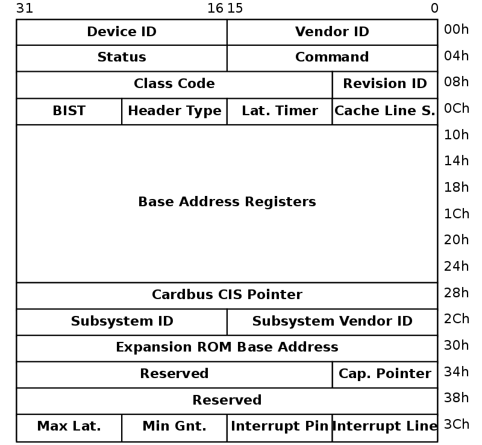

## NỘI DUNG

### 1. Chuẩn bị:

Build lại kernel không có net driver. 

### 3. Bus-Independent device access

Linux cung cấp 1 tập API biểu diễn trừu tượng các I/O operations qua tất cả các bus và device. Cho phép device drivers ghi độc lập trên các kiểu bus.
### Memory mapped I/O là gì ?

Memory-mapped I/O sử dụng cùng bus địa chỉ để định địa chỉ cho memory và các thiết bị I/O.

Memory và các thanh ghi của thiết bị I/O được map tới giá trị địa chỉ. Vì vậy khi 1 địa chỉ được sử dụng bởi CPU, địa chỉ đó có thể chỉ tới một vùng nhớ RAM, hoặc là vùng nhớ của thiết bị I/O.

Do dó, các câu lệnh CPU được sử dụng để truy cập tới không gian vùng nhớ có thể được sử dụng để truy cập thiết bị.

Mỗi thiết bị I/O quan sát một bus địa chỉ của CPU và tương ứng với bất kỳ sự truy cập nào của CPU quan không gian địa chỉ được gán cho thiết bị đó.

#### Memory-Map I/O

Hình thức phổ biến nhất được hỗ trợ của I/O là memory-mapped I/O. Đó là một phần không gian địa chỉ CPU được hiểu là không truy cập vào bộ nhớ, nhưng truy cập vào các device. Một vài kiến trúc định nghĩa device ở một địa chỉ cố định, Nhưng hầu hết có một vài phương pháp để thấy device.

Physical address là kiểu unsigned long. Những address này không nên sử dụng trực tiếp. thay vào đó để nhận một address hợp lý cho việc chuyển các chức năng được mô tả bên duới, chúng ta nên gọi ioremap. Một address hợp lý cho việc truy cập device sẽ được trả về.

Sau khi kết thúc sử dụng device, gọi iounmap để trả về không gian địa chỉ cho kernel. Hầu hết các kiến trúc chỉ định không gian địa chỉ mới mỗi lần chúng ta gọi ioremap, và chúng có thể run out cho tới khi gọi iounmap.

#### Accessing the device

Một phần của giao diện được sử dụng nhiều nhất bởi drivers là việc đọc và ghi các thanh ghi bộ nhớ ánh xạ trên device. Linux cung cấp giao diện để đọc và ghi 8 bit, 16 bit, 32 bit, 64 bit. (byte, word, long, and quad). Cả truy cập đọc và ghi được hỗ trợ. các chức năng được đăt tên readb, readw, readl, readq, writeb, writew, writel, writeq.

Một vài device (như framebuffer) có thể muốn sử dụng các đường truyền lớn hơn 8 bit cùng một thời điểm. Đối với những thiết bị này compiler không cho phép sắp xếp lại các chuỗi I/O. khi thứ tự có thể là compiler được tối ưu, chúng ta sử dụng __readb và friends để chỉ ra the relaxed ordering. Sử dụng với care, rmb cung cấp một

#### Port space access

Hình thức khác của I/O được hỗ trợ là port space. Đây là một loạt các địa chỉ khác với không gian địa chỉ bộ nhớ thông thường. Truy cập vào các địa chỉ này thường không nhanh bằng truy cập vào địa chỉ bộ nhớ được ánh xạ, và nó cũng có một không gian địa chỉ nhỏ hơn.

Không giống với memory I/O, không cần chuẩn bị để truy cập vào không gian của port.

#### Truy cập port space hay I/O mapped device

Truy cập không gian này được cung cấp thông qua một tập các hàm cho 8 bit , 16 bit và 32 bit. Các hàm này là inb, inw, inl, outb, outw, outl

Một vài biến thể được cung cấp cho những hàm đó. một vài device yêu cầu các truy cập tới cổng của chúng bị chậm lại

### Understanding PCI configuration space

PCI devices đặc trưng bằng không gian địa chỉ 256 byte. 64 bytes đầu là được chuẩn hóa trong khi phần còn lại là phụ thuộc vào device. 

VENDER_ID và DEVICE_ID  là định danh duy nhất chỉ định tới nhà sản xuất và device. Một trường khác là Base Address Register, thông thường viết tắt là BAR. 

### Khởi tạo net_device

